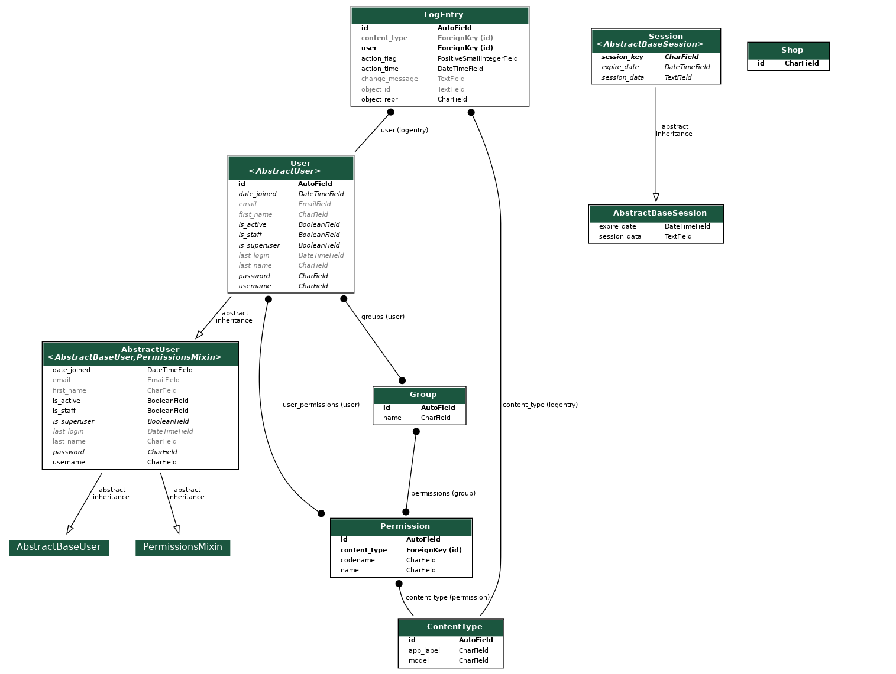

# アプリ名
- Grunavi（グルナビ）

## コンセプト
- 周辺のグルメを発見しよう！

## 該当プロジェクトのリポジトリ URL
- GitHub：[Grunavi](https://github.com/sorandada/RPRO)

# 開発環境
## 開発環境
- Windows 11 Home
- Visual Studio Code 1.77.3
- Ubuntu 20.04

## 開発言語
- Python 3.8.10
- HTML
- CSS
- JavaScript

## フレームワーク
- Django 4.2
- Bootstrap 5 ([ThemeWagom](https://themewagon.com/theme-framework/bootstrap-5/))

## 動作対象OS
- Windows、
MacOS X、
Linux / Unix、
Solaris、
etc...

# 開発期間
- 4日間

# アプリケーション機能

## 機能一覧
- レストラン検索：ホットペッパーグルメサーチAPIを使用して、現在地周辺の飲食店を検索する、範囲指定。
- レストラン情報取得：ホットペッパーグルメサーチAPIを使用して、飲食店の詳細情報を取得する。
- 地図アプリ連携：飲食店の所在地を地図アプリに連携する。

## 画面一覧
- 検索＋一覧画面：条件を指定してレストランを検索する。検索結果の飲食店を一覧表示する。

- 詳細画面：店舗の詳細情報を表示する。

## 使用しているAPI,SDK,ライブラリなど
- ホットペッパーグルメサーチAPI
- Google Maps Embed API

## テーブル定義（ER図）

# ポイント
## こだわったポイント
- 店舗一覧で何件表示されているかを見れるようにした。
- 詳細画面では、店舗の詳細情報に加え、店のジャンル表示や、googlemapを設置した。

## デザイン面でこだわったポイント
- 直感的に分かりやすいデザイン。

## アドバイスして欲しいポイント
- コードが見にくくないか。
- もっとこうしたほうが良いなどのアドバイスが欲しい。
- gitのコミットについて。
- ウェブアプリ開発に必要な知識、技術、勉強しておいた方が良いこと。

## 自己評価
- 飲食店の一覧リストをスライド形式でも表示したい。
- 詳細画面に、店舗に関連する店舗を複数表示したい。
- 前回頂いたアドバイスを意識した。
- APIを使用するのが初めてだったが、使うことが出来た。
- わからないところの調べ方が下手で時間がかかってしまった。
- API、JSON、GET、POSTなどの基本的なことが理解できていなかった。